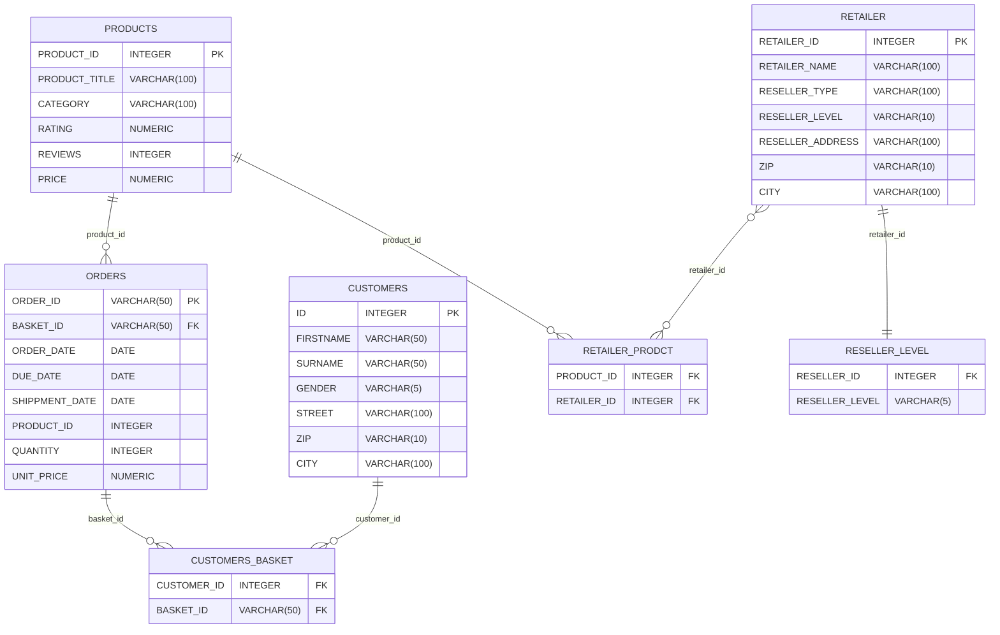

# BI Assessment Database
This demo database was developed for assessment issues in the BI context. 
It conssits of a variety of different tables each including artificial data.

## Prerequisites
The prepared code was developed and tested using pgSQL. You can either run the database in an online or 
local instance of pgSQL.

- dowload pgAdmin https://www.pgadmin.org/ if you do not have installed it, yet
- setupt a new database
- follow the database setup script setup_database.sql

## Database Structure
```
mermaid


The database also has schema called lake:
```
mermaid
erDiagram
RETAILER_AD_CAMPAIGN_DL{
	RT_AD_H_SK      	VARCHAR(100) PK
    RETAILER_ID    		INTEGER
    RETAILER_NAME  		VARCHAR(100)
    CAMPAIGN_ID    		INTEGER
    CAMPAIGN_NAME  		VARCHAR(500)
    CAMPAIGN_BUDGET   	DECIMAL
    START_DATE     		DATE
    END_DATE       		DATE
    PRODUCT_ID     		INTEGER
    PRODUCT_TITLE  		VARCHAR(100)
    CATEGORY       		VARCHAR(100)
    MAX_CPC_BID    		DECIMAL
}

TRACKING_CAMPAIGN_DL{
	TRACKING_AD_H_SK       VARCHAR(100) PK
    SESSION_ID             VARCHAR(100)
    VISITOR_ID             VARCHAR(100)
    EVENT_TIMESTAMP_CET    TIMESTAMP
    FORMAT                 VARCHAR(100)
    PAGE                   VARCHAR(100)
    CAMPAIGN_ID            INTEGER
    PRODUCT_ID             INTEGER
    IMPRESSION_ID          VARCHAR(100)
    AD_POSITION            VARCHAR(5)
    AD_MESSAGE_TYPE        VARCHAR(100)
    WINNING_BID            DECIMAL
    BOT                    BOOLEAN
}
```

Legal Information
All data used in this demo database are fictional and do not relate to any company or private person. Addresses, names and dates are created based on a huge fictional database of names using a random number generator for combinations and do not represent any private person.

If you come across any issues please inform me as an owner of the repository.