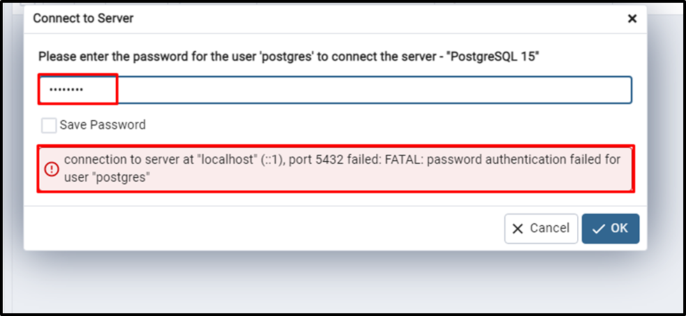
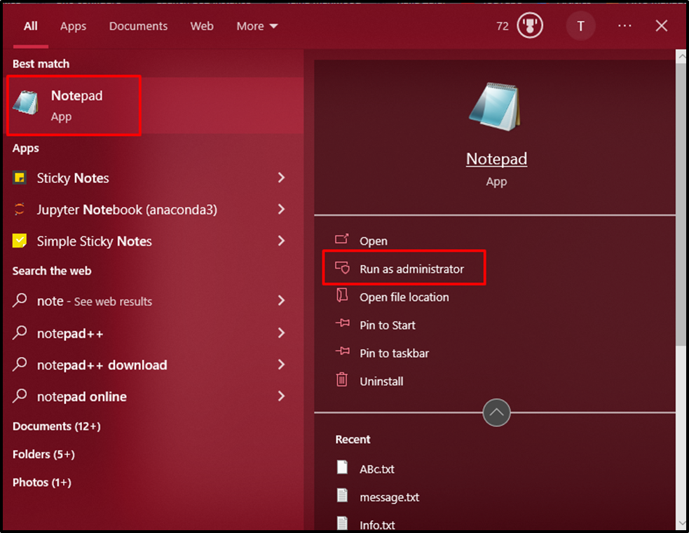
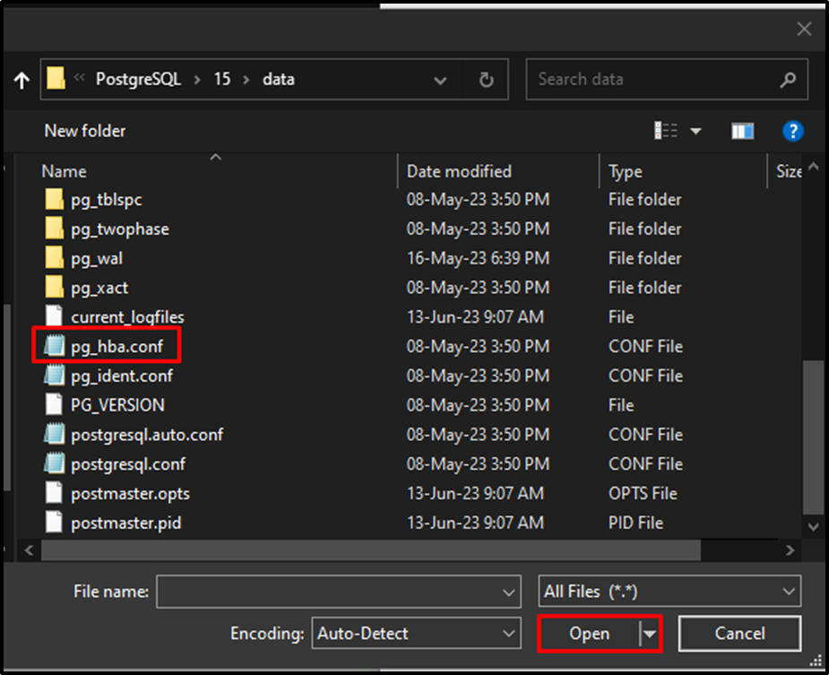
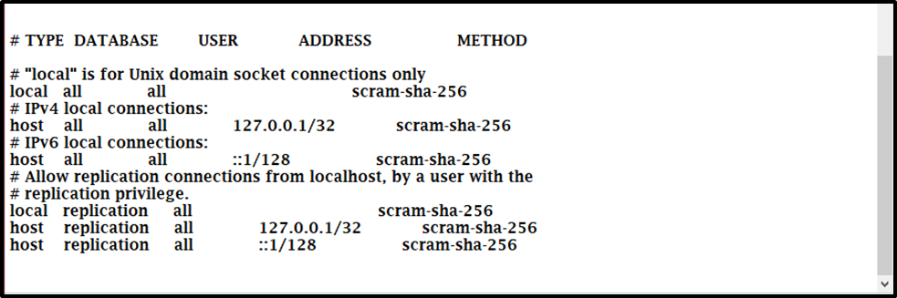
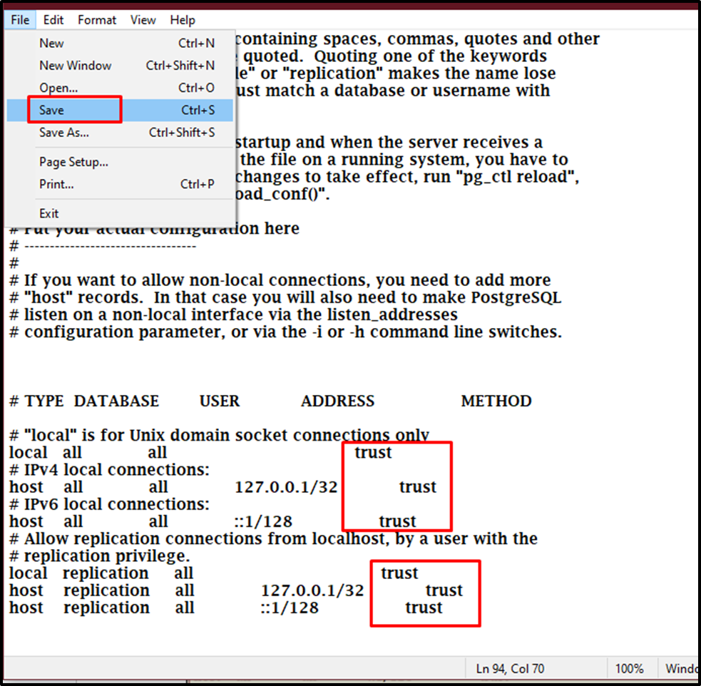
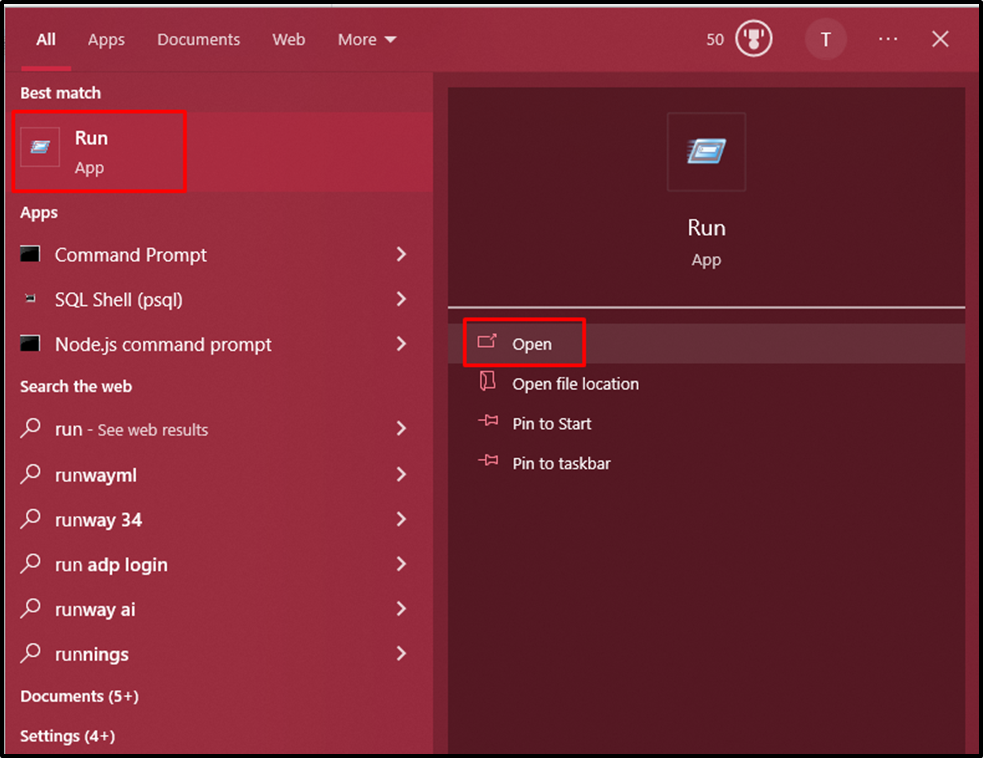
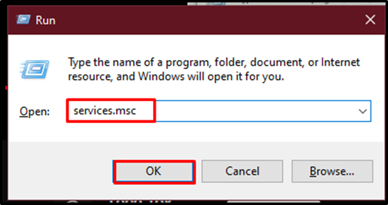
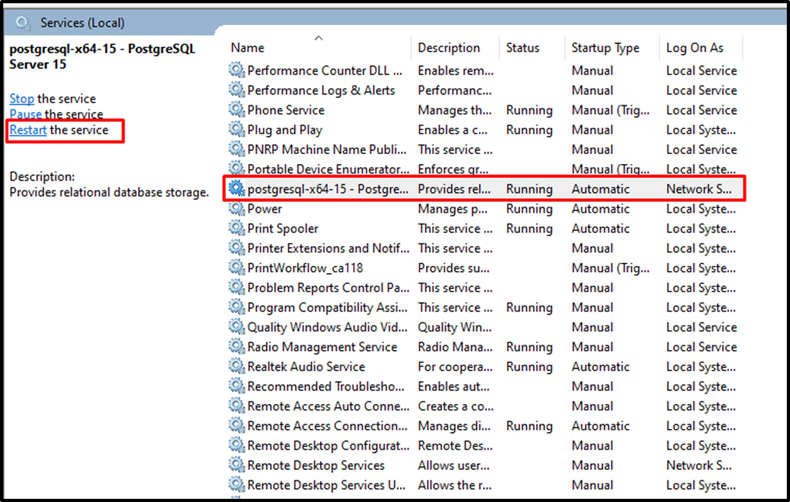

# Troubleshooting 

## pgAdmin4 - Fatal: Password 

**How to Solve the FATAL: Password Authentication Failed for User Postgres Error?**

This error occurs in the PostgreSQL client application when the user provides the wrong password while connecting to the server:

To rectify the stated error, first, open the Notepad from the computer by clicking on the “**Run as administrator**” button:

Head into the “**data**” folder from the “**PostgreSQL**” directory to select the “**pg_hba.conf**” file and click on the “**Open**” button:

Scroll down to the bottom of the file to copy the last section of the file and store it on the local system:

After that, change the “**scram-sha-256**” with the “**trust**” keyword in the “**METHOD**” column, and click on the “**Save**” button from the “**File**” menu:

Open the “**Run**” dialog box from the local system:

Type the “**services.msc**” and click on the “**OK**” button:

Locate the “**PostgreSQL**” file from the list of all the services to click on it and then click on the “**restart**” button:

Restart the PostgreSQL client and it will allow the user to access the Postgres database to open the “**Query Tool**”:

> Source:https://www.commandprompt.com/education/how-to-solve-the-fatal-password-authentication-failed-for-user-postgres-error/#:~:text=To%20solve%20the%20Fatal%3A%20password%20authentication%20failed%20for%20the%20user,msc%E2%80%9D%20application.